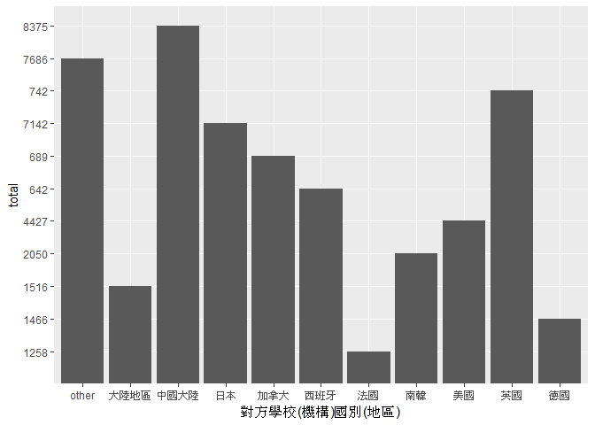

106-2 大數據分析方法 作業二
================
陳世諭

作業完整說明[連結](https://docs.google.com/document/d/1aLGSsGXhgOVgwzSg9JdaNz2qGPQJSoupDAQownkGf_I/edit?usp=sharing)

學習再也不限定在自己出生的國家，台灣每年有許多學生選擇就讀國外的大專院校，同時也有人多國外的學生來台灣就讀，透過分析[大專校院境外學生人數統計](https://data.gov.tw/dataset/6289)、[大專校院本國學生出國進修交流數](https://data.gov.tw/dataset/24730)、[世界各主要國家之我國留學生人數統計表](https://ws.moe.edu.tw/Download.ashx?u=C099358C81D4876CC7586B178A6BD6D5062C39FB76BDE7EC7685C1A3C0846BCDD2B4F4C2FE907C3E7E96F97D24487065577A728C59D4D9A4ECDFF432EA5A114C8B01E4AFECC637696DE4DAECA03BB417&n=4E402A02CE6F0B6C1B3C7E89FDA1FAD0B5DDFA6F3DA74E2DA06AE927F09433CFBC07A1910C169A1845D8EB78BD7D60D7414F74617F2A6B71DC86D17C9DA3781394EF5794EEA7363C&icon=..csv)可以了解103年以後各大專院校國際交流的情形。請同學分析以下議題，並以視覺化的方式呈現分析結果，呈現103年以後大專院校國際交流的情形。

來台境外生分析
--------------

### 資料匯入與處理

``` r
library(readr)
```

    ## Warning: package 'readr' was built under R version 3.4.4

``` r
library(dplyr)
```

    ## 
    ## Attaching package: 'dplyr'

    ## The following objects are masked from 'package:stats':
    ## 
    ##     filter, lag

    ## The following objects are masked from 'package:base':
    ## 
    ##     intersect, setdiff, setequal, union

``` r
out103<-read_csv("https://quality.data.gov.tw/dq_download_csv.php?nid=6289&md5_url=25f64d5125016dcd6aed42e50c972ed0")
```

    ## Parsed with column specification:
    ## cols(
    ##   洲別 = col_character(),
    ##   國別 = col_character(),
    ##   `學位生-正式修讀學位外國生` = col_integer(),
    ##   `學位生-僑生(含港澳)` = col_integer(),
    ##   `學位生-正式修讀學位陸生` = col_integer(),
    ##   `非學位生-外國交換生` = col_integer(),
    ##   `非學位生-外國短期研習及個人選讀` = col_integer(),
    ##   `非學位生-大專附設華語文中心學生` = col_integer(),
    ##   `非學位生-大陸研修生` = col_integer(),
    ##   `非學位生-海青班` = col_integer(),
    ##   境外專班 = col_integer()
    ## )

``` r
out104<-read_csv("https://quality.data.gov.tw/dq_download_csv.php?nid=6289&md5_url=4d3e9b37b7b0fd3aa18a388cdbc77996")
```

    ## Parsed with column specification:
    ## cols(
    ##   洲別 = col_character(),
    ##   國別 = col_character(),
    ##   `學位生-正式修讀學位外國生` = col_integer(),
    ##   `學位生-僑生(含港澳)` = col_integer(),
    ##   `學位生-正式修讀學位陸生` = col_integer(),
    ##   `非學位生-外國交換生` = col_integer(),
    ##   `非學位生-外國短期研習及個人選讀` = col_integer(),
    ##   `非學位生-大專附設華語文中心學生` = col_integer(),
    ##   `非學位生-大陸研修生` = col_integer(),
    ##   `非學位生-海青班` = col_integer(),
    ##   境外專班 = col_integer()
    ## )

``` r
out105<-read_csv("https://quality.data.gov.tw/dq_download_csv.php?nid=6289&md5_url=19bedf88cf46999da12513de755c33c6")
```

    ## Parsed with column specification:
    ## cols(
    ##   洲別 = col_character(),
    ##   國別 = col_character(),
    ##   學位生_正式修讀學位外國生 = col_integer(),
    ##   `學位生_僑生(含港澳)` = col_integer(),
    ##   學位生_正式修讀學位陸生 = col_integer(),
    ##   非學位生_外國交換生 = col_integer(),
    ##   非學位生_外國短期研習及個人選讀 = col_integer(),
    ##   非學位生_大專附設華語文中心學生 = col_integer(),
    ##   非學位生_大陸研修生 = col_integer(),
    ##   非學位生_海青班 = col_integer(),
    ##   境外專班 = col_integer()
    ## )

``` r
out106<-read_csv("https://quality.data.gov.tw/dq_download_csv.php?nid=6289&md5_url=50e3370f9f8794f2054c0c82a2ed8c91")
```

    ## Parsed with column specification:
    ## cols(
    ##   洲別 = col_character(),
    ##   國別 = col_character(),
    ##   學位生_正式修讀學位外國生 = col_integer(),
    ##   `學位生_僑生(含港澳)` = col_integer(),
    ##   學位生_正式修讀學位陸生 = col_integer(),
    ##   非學位生_外國交換生 = col_integer(),
    ##   非學位生_外國短期研習及個人選讀 = col_integer(),
    ##   非學位生_大專附設華語文中心學生 = col_integer(),
    ##   非學位生_大陸研修生 = col_integer(),
    ##   非學位生_海青班 = col_integer(),
    ##   境外專班 = col_integer()
    ## )

``` r
out103$total<-rowSums(out103[,3:11],na.rm = T)
out104$total<-rowSums(out104[,3:11],na.rm = T)
out105$total<-rowSums(out105[,3:11],na.rm = T)
out106$total<-rowSums(out106[,3:11],na.rm = T)

total<-merge(select(out103,"國別",total),
             select(out104,"國別",total),
             "國別")
total<-merge(total,
             select(out105,"國別",total),
             "國別")
total<-merge(total,
             select(out106,"國別",total),
             "國別")
```

    ## Warning in merge.data.frame(total, select(out106, "國別", total), "國別"):
    ## column names 'total.x', 'total.y' are duplicated in the result

``` r
names(total)<-c("國別","103","104","105","106")


s103<-read_csv("https://quality.data.gov.tw/dq_download_csv.php?nid=6289&md5_url=a6d1469f39fe41fb81dbfc373aef3331")
```

    ## Parsed with column specification:
    ## cols(
    ##   學校類型 = col_character(),
    ##   學校代碼 = col_character(),
    ##   學校名稱 = col_character(),
    ##   `學位生-正式修讀學位外國生` = col_integer(),
    ##   `學位生-僑生(含港澳)` = col_integer(),
    ##   `學位生-正式修讀學位陸生` = col_integer(),
    ##   `非學位生-外國交換生` = col_integer(),
    ##   `非學位生-外國短期研習及個人選讀` = col_integer(),
    ##   `非學位生-大專附設華語文中心學生` = col_integer(),
    ##   `非學位生-大陸研修生` = col_character(),
    ##   `非學位生-海青班` = col_integer(),
    ##   境外專班 = col_integer()
    ## )

``` r
s104<-read_csv("https://quality.data.gov.tw/dq_download_csv.php?nid=6289&md5_url=8baeae81cba74f35cf0bb1333d3d99f5")
```

    ## Parsed with column specification:
    ## cols(
    ##   學校類型 = col_character(),
    ##   學校代碼 = col_character(),
    ##   學校名稱 = col_character(),
    ##   `學位生-正式修讀學位外國生` = col_integer(),
    ##   `學位生-僑生(含港澳)` = col_integer(),
    ##   `學位生-正式修讀學位陸生` = col_integer(),
    ##   `非學位生-外國交換生` = col_integer(),
    ##   `非學位生-外國短期研習及個人選讀` = col_integer(),
    ##   `非學位生-大專附設華語文中心學生` = col_integer(),
    ##   `非學位生-大陸研修生` = col_character(),
    ##   `非學位生-海青班` = col_integer(),
    ##   境外專班 = col_integer()
    ## )

``` r
s105<-read_csv("https://quality.data.gov.tw/dq_download_csv.php?nid=6289&md5_url=1a485383cf9995da679c3798ab4fd681")
```

    ## Parsed with column specification:
    ## cols(
    ##   學校類型 = col_character(),
    ##   學校代碼 = col_character(),
    ##   學校名稱 = col_character(),
    ##   學位生_正式修讀學位外國生 = col_integer(),
    ##   `學位生_僑生(含港澳)` = col_integer(),
    ##   學位生_正式修讀學位陸生 = col_integer(),
    ##   非學位生_外國交換生 = col_integer(),
    ##   非學位生_外國短期研習及個人選讀 = col_integer(),
    ##   非學位生_大專附設華語文中心學生 = col_integer(),
    ##   非學位生_大陸研修生 = col_integer(),
    ##   非學位生_海青班 = col_integer(),
    ##   境外專班 = col_integer()
    ## )

``` r
s106<-read_csv("https://quality.data.gov.tw/dq_download_csv.php?nid=6289&md5_url=883e2ab4d5357f70bea9ac44a47d05cc")
```

    ## Parsed with column specification:
    ## cols(
    ##   學校類型 = col_character(),
    ##   學校代碼 = col_character(),
    ##   學校名稱 = col_character(),
    ##   學位生_正式修讀學位外國生 = col_integer(),
    ##   `學位生_僑生(含港澳)` = col_integer(),
    ##   學位生_正式修讀學位陸生 = col_integer(),
    ##   非學位生_外國交換生 = col_integer(),
    ##   非學位生_外國短期研習及個人選讀 = col_integer(),
    ##   非學位生_大專附設華語文中心學生 = col_integer(),
    ##   非學位生_大陸研修生 = col_integer(),
    ##   非學位生_海青班 = col_integer(),
    ##   境外專班 = col_integer()
    ## )

``` r
s103$`非學位生-大陸研修生`<-as.numeric(gsub("…",NA,s103$`非學位生-大陸研修生`))
s104$`非學位生-大陸研修生`<-as.numeric(gsub("…",NA,s104$`非學位生-大陸研修生`))

s103$total<-rowSums(s103[,4:12],na.rm = T)
s104$total<-rowSums(s104[,4:12],na.rm = T)
s105$total<-rowSums(s105[,4:12],na.rm = T)
s106$total<-rowSums(s106[,4:12],na.rm = T)

sMerge<-merge(select(s103,"學校名稱",total),
              select(s104,"學校名稱",total),
              "學校名稱")
sMerge<-merge(sMerge,
              select(s105,"學校名稱",total),
              "學校名稱")
sMerge<-merge(sMerge,
              select(s106,"學校名稱",total),
              "學校名稱")
```

    ## Warning in merge.data.frame(sMerge, select(s106, "學校名稱", total), "學校
    ## 名稱"): column names 'total.x', 'total.y' are duplicated in the result

``` r
names(sMerge)<-c("學校名稱","103","104","105","106")

library(choroplethr)
```

    ## Warning: package 'choroplethr' was built under R version 3.4.4

    ## Loading required package: acs

    ## Warning: package 'acs' was built under R version 3.4.4

    ## Loading required package: stringr

    ## Warning: package 'stringr' was built under R version 3.4.4

    ## Loading required package: XML

    ## 
    ## Attaching package: 'acs'

    ## The following object is masked from 'package:dplyr':
    ## 
    ##     combine

    ## The following object is masked from 'package:base':
    ## 
    ##     apply

``` r
CountriesComparisionTable <- read_csv("CountriesComparisionTable.csv")
```

    ## Parsed with column specification:
    ## cols(
    ##   ISO3 = col_character(),
    ##   English = col_character(),
    ##   Taiwan = col_character()
    ## )

### 哪些國家來台灣唸書的學生最多呢？

``` r
totalPrint<-total%>%
  mutate(totalpeople = rowSums(total[,2:5]))%>%
  select("國別",totalpeople)%>%
  arrange(desc(totalpeople))%>%
  head(10)
```

    ## Warning: package 'bindrcpp' was built under R version 3.4.4

``` r
head(totalPrint,10)
```

    ##        國別 totalpeople
    ## 1  中國大陸      152524
    ## 2  馬來西亞       62031
    ## 3      香港       31940
    ## 4      日本       28200
    ## 5      越南       21670
    ## 6      澳門       20302
    ## 7      印尼       19620
    ## 8      南韓       16948
    ## 9      美國       14846
    ## 10     泰國        7035

### 哪間大學的境外生最多呢？

``` r
sMerge<-sMerge%>%
  mutate(totalpeople = rowSums(sMerge[,2:5]))%>%
  select("學校名稱",totalpeople)%>%
  arrange(desc(totalpeople))%>%
  head(10)
head(sMerge,10)
```

    ##            學校名稱 totalpeople
    ## 1  國立臺灣師範大學       22113
    ## 2      國立臺灣大學       18199
    ## 3      中國文化大學       16074
    ## 4          銘傳大學       16057
    ## 5          淡江大學       13887
    ## 6      國立政治大學       11626
    ## 7      國立成功大學       10982
    ## 8          輔仁大學        9499
    ## 9          逢甲大學        9474
    ## 10         中原大學        7662

### 各個國家來台灣唸書的學生人數條狀圖

``` r
total<-total%>%
  mutate(totalpeople = rowSums(total[,2:5]))%>%
  select("國別",totalpeople)%>%
  arrange(desc(totalpeople))
total[11,]<-c("other",sum(total[11:139,2]))
total<-total[-(12:139),]
library(ggplot2)
```

    ## Warning: package 'ggplot2' was built under R version 3.4.4

``` r
ggplot()+
  geom_bar(data = total,
           aes(x=國別,y=totalpeople),
           stat = "identity")
```


### 各個國家來台灣唸書的學生人數面量圖

``` r
names(totalPrint)<-c("Taiwan","people")
newTotal<-merge(CountriesComparisionTable,totalPrint,"Taiwan")
newTotal<-select(newTotal,English,people)
newTotal<-group_by(newTotal,English)%>%
  summarise(people=sum(people))
newTotal<-newTotal[-120,]
names(newTotal)<-c("region","value")
country_choropleth(newTotal)
```

    ## Warning in super$initialize(country.map, user.df): Your data.frame contains
    ## the following regions which are not mappable: Unmatch

    ## Warning in self$bind(): The following regions were missing and are being
    ## set to NA: afghanistan, angola, azerbaijan, moldova, madagascar, mexico,
    ## macedonia, mali, myanmar, montenegro, mongolia, mozambique, mauritania,
    ## burundi, malawi, namibia, france, niger, nigeria, nicaragua, netherlands,
    ## norway, nepal, belgium, new zealand, oman, pakistan, panama, peru,
    ## philippines, papua new guinea, poland, benin, portugal, paraguay, israel,
    ## qatar, romania, russia, rwanda, western sahara, saudi arabia, sudan,
    ## burkina faso, south sudan, senegal, solomon islands, sierra leone, el
    ## salvador, somaliland, somalia, republic of serbia, suriname, slovakia,
    ## bangladesh, slovenia, sweden, swaziland, syria, chad, togo, tajikistan,
    ## turkmenistan, east timor, bulgaria, trinidad and tobago, tunisia, turkey,
    ## taiwan, united republic of tanzania, uganda, ukraine, uruguay, uzbekistan,
    ## the bahamas, venezuela, vanuatu, yemen, south africa, zambia, zimbabwe,
    ## bosnia and herzegovina, belarus, albania, belize, bolivia, brazil, brunei,
    ## bhutan, botswana, central african republic, canada, switzerland, chile,
    ## united arab emirates, ivory coast, cameroon, democratic republic of the
    ## congo, republic of congo, colombia, costa rica, cuba, northern cyprus,
    ## cyprus, argentina, czech republic, germany, djibouti, denmark, dominican
    ## republic, algeria, ecuador, egypt, eritrea, spain, armenia, estonia,
    ## ethiopia, finland, fiji, united kingdom, gabon, georgia, ghana, antarctica,
    ## guinea, gambia, guinea bissau, equatorial guinea, greece, guatemala,
    ## guyana, honduras, croatia, haiti, hungary, india, ireland, iran, iraq,
    ## iceland, italy, australia, jamaica, jordan, kazakhstan, kenya, kyrgyzstan,
    ## cambodia, south korea, kosovo, kuwait, austria, laos, lebanon, liberia,
    ## libya, sri lanka, lesotho, lithuania, luxembourg, latvia, morocco


台灣學生國際交流分析
--------------------

### 資料匯入與處理

``` r
library(readxl)
```

    ## Warning: package 'readxl' was built under R version 3.4.4

``` r
Student_RPT_07 <- read_excel("Student_RPT_07.xlsx")
```

### 台灣大專院校的學生最喜歡去哪些國家進修交流呢？

``` r
byCountry<-group_by(Student_RPT_07,`對方學校(機構)國別(地區)`)%>%
  summarise(total = sum(小計))%>%
  arrange(desc(total))%>%
  head(10)
head(byCountry,10)
```

    ## # A tibble: 10 x 2
    ##    `對方學校(機構)國別(地區)` total
    ##    <chr>                      <dbl>
    ##  1 中國大陸                   8375.
    ##  2 日本                       7142.
    ##  3 美國                       4427.
    ##  4 南韓                       2050.
    ##  5 大陸地區                   1516.
    ##  6 德國                       1466.
    ##  7 法國                       1258.
    ##  8 英國                        742.
    ##  9 加拿大                      689.
    ## 10 西班牙                      642.

### 哪間大學的出國交流學生數最多呢？

``` r
byCollege<-group_by(Student_RPT_07,`學校名稱`)%>%
  summarise(total = sum(小計))%>%
  arrange(desc(total))%>%
  head(10)
head(byCollege,10)
```

    ## # A tibble: 10 x 2
    ##    學校名稱     total
    ##    <chr>        <dbl>
    ##  1 國立臺灣大學 2224.
    ##  2 淡江大學     2038.
    ##  3 國立政治大學 1876.
    ##  4 逢甲大學     1346.
    ##  5 元智大學     1106.
    ##  6 國立臺北大學  956.
    ##  7 國立交通大學  951.
    ##  8 東海大學      931.
    ##  9 東吳大學      873.
    ## 10 國立成功大學  846.

### 台灣大專院校的學生最喜歡去哪些國家進修交流條狀圖

``` r
barCountry<-group_by(Student_RPT_07,`對方學校(機構)國別(地區)`)%>%
  summarise(total = sum(小計))%>%
  arrange(desc(total))

barCountry[11,]<-c("other",sum(barCountry[11:116,2]))
barCountry<-barCountry[-(12:116),]
  
ggplot()+
  geom_bar(data = barCountry,
           aes(x=`對方學校(機構)國別(地區)`,y=total),
           stat = 'identity')
```



### 台灣大專院校的學生最喜歡去哪些國家進修交流面量圖

``` r
names(barCountry)<-c("Taiwan","total")
newByCountry<-
  merge(barCountry,CountriesComparisionTable,"Taiwan")%>%
  select(English,total)
names(newByCountry)<-c("region","value")
newByCountry<-newByCountry[-c(19,43,70,76,78,11),]

country_choropleth(newByCountry)
```

    ## Warning in self$bind(): The following regions were missing and are being
    ## set to NA: afghanistan, angola, azerbaijan, moldova, madagascar, mexico,
    ## macedonia, mali, myanmar, montenegro, mongolia, mozambique, mauritania,
    ## burundi, malawi, malaysia, namibia, niger, nigeria, nicaragua, netherlands,
    ## norway, nepal, belgium, new zealand, oman, pakistan, panama, peru,
    ## philippines, papua new guinea, poland, benin, portugal, paraguay, israel,
    ## qatar, romania, russia, rwanda, western sahara, saudi arabia, sudan,
    ## burkina faso, south sudan, senegal, solomon islands, sierra leone, el
    ## salvador, somaliland, somalia, republic of serbia, suriname, slovakia,
    ## bangladesh, slovenia, sweden, swaziland, syria, chad, togo, thailand,
    ## tajikistan, turkmenistan, east timor, bulgaria, trinidad and tobago,
    ## tunisia, turkey, taiwan, united republic of tanzania, uganda, ukraine,
    ## uruguay, uzbekistan, the bahamas, venezuela, vietnam, vanuatu, yemen, south
    ## africa, zambia, zimbabwe, bosnia and herzegovina, belarus, albania, belize,
    ## bolivia, brazil, brunei, bhutan, botswana, central african republic,
    ## switzerland, chile, united arab emirates, ivory coast, cameroon, democratic
    ## republic of the congo, republic of congo, colombia, costa rica, cuba,
    ## northern cyprus, cyprus, argentina, czech republic, djibouti, denmark,
    ## dominican republic, algeria, ecuador, egypt, eritrea, armenia, estonia,
    ## ethiopia, finland, fiji, gabon, georgia, ghana, antarctica, guinea, gambia,
    ## guinea bissau, equatorial guinea, greece, guatemala, guyana, honduras,
    ## croatia, haiti, hungary, indonesia, india, ireland, iran, iraq, iceland,
    ## italy, australia, jamaica, jordan, kazakhstan, kenya, kyrgyzstan, cambodia,
    ## south korea, kosovo, kuwait, austria, laos, lebanon, liberia, libya, sri
    ## lanka, lesotho, lithuania, luxembourg, latvia, morocco


台灣學生出國留學分析
--------------------

### 資料匯入與處理

``` r
TW<-read_csv("https://ws.moe.edu.tw/Download.ashx?u=C099358C81D4876CC7586B178A6BD6D5062C39FB76BDE7EC7685C1A3C0846BCDD2B4F4C2FE907C3E7E96F97D24487065577A728C59D4D9A4ECDFF432EA5A114C8B01E4AFECC637696DE4DAECA03BB417&n=4E402A02CE6F0B6C1B3C7E89FDA1FAD0B5DDFA6F3DA74E2DA06AE927F09433CFBC07A1910C169A1845D8EB78BD7D60D7414F74617F2A6B71DC86D17C9DA3781394EF5794EEA7363C&icon=..csv")
```

    ## Warning: Missing column names filled in: 'X4' [4], 'X5' [5], 'X6' [6]

    ## Parsed with column specification:
    ## cols(
    ##   洲別 = col_character(),
    ##   國別 = col_character(),
    ##   總人數 = col_number(),
    ##   X4 = col_character(),
    ##   X5 = col_character(),
    ##   X6 = col_character()
    ## )

### 台灣學生最喜歡去哪些國家留學呢？

``` r
TW<-select(TW,"國別","總人數")%>%
  arrange(desc(總人數))%>%
  head(10)
head(TW,10)
```

    ## # A tibble: 10 x 2
    ##    國別     總人數
    ##    <chr>     <dbl>
    ##  1 美國     21127.
    ##  2 澳大利亞 13582.
    ##  3 日本      8444.
    ##  4 加拿大    4827.
    ##  5 英國      3815.
    ##  6 德國      1488.
    ##  7 紐西蘭    1106.
    ##  8 波蘭       561.
    ##  9 馬來西亞   502.
    ## 10 奧地利     419.

### 台灣學生最喜歡去哪些國家留學面量圖

``` r
names(TW)<-c("Taiwan","value")
newTW<-merge(TW,CountriesComparisionTable,"Taiwan")%>%
  select(English,value)

names(newTW)<-c("region","value")

country_choropleth(newTW)
```

    ## Warning in self$bind(): The following regions were missing and are being
    ## set to NA: afghanistan, angola, azerbaijan, moldova, madagascar, mexico,
    ## macedonia, mali, myanmar, montenegro, mongolia, mozambique, mauritania,
    ## burundi, malawi, namibia, france, niger, nigeria, nicaragua, netherlands,
    ## norway, nepal, belgium, oman, pakistan, panama, peru, philippines, papua
    ## new guinea, north korea, benin, portugal, paraguay, israel, qatar, romania,
    ## russia, rwanda, western sahara, saudi arabia, sudan, burkina faso, south
    ## sudan, senegal, solomon islands, sierra leone, el salvador, somaliland,
    ## somalia, republic of serbia, suriname, slovakia, bangladesh, slovenia,
    ## sweden, swaziland, syria, chad, togo, thailand, tajikistan, turkmenistan,
    ## east timor, bulgaria, trinidad and tobago, tunisia, turkey, taiwan, united
    ## republic of tanzania, uganda, ukraine, uruguay, uzbekistan, the bahamas,
    ## venezuela, vietnam, vanuatu, yemen, south africa, zambia, zimbabwe,
    ## bosnia and herzegovina, belarus, albania, belize, bolivia, brazil, brunei,
    ## bhutan, botswana, central african republic, switzerland, chile, united arab
    ## emirates, china, ivory coast, cameroon, democratic republic of the congo,
    ## republic of congo, colombia, costa rica, cuba, northern cyprus, cyprus,
    ## argentina, czech republic, djibouti, denmark, dominican republic, algeria,
    ## ecuador, egypt, eritrea, spain, armenia, estonia, ethiopia, finland,
    ## fiji, gabon, georgia, ghana, antarctica, guinea, gambia, guinea bissau,
    ## equatorial guinea, greece, guatemala, guyana, honduras, croatia, haiti,
    ## hungary, indonesia, india, ireland, iran, iraq, iceland, italy, jamaica,
    ## jordan, kazakhstan, kenya, kyrgyzstan, cambodia, south korea, kosovo,
    ## kuwait, laos, lebanon, liberia, libya, sri lanka, lesotho, lithuania,
    ## luxembourg, latvia, morocco


綜合分析
--------

請問來台讀書與離台讀書的來源國與留學國趨勢是否相同(5分)？想來台灣唸書的境外生，他們的母國也有很多台籍生嗎？請圖文並茂說明你的觀察(10分)。

``` r
country_choropleth(newTotal)
```

    ## Warning in super$initialize(country.map, user.df): Your data.frame contains
    ## the following regions which are not mappable: Unmatch

    ## Warning in self$bind(): The following regions were missing and are being
    ## set to NA: afghanistan, angola, azerbaijan, moldova, madagascar, mexico,
    ## macedonia, mali, myanmar, montenegro, mongolia, mozambique, mauritania,
    ## burundi, malawi, namibia, france, niger, nigeria, nicaragua, netherlands,
    ## norway, nepal, belgium, new zealand, oman, pakistan, panama, peru,
    ## philippines, papua new guinea, poland, benin, portugal, paraguay, israel,
    ## qatar, romania, russia, rwanda, western sahara, saudi arabia, sudan,
    ## burkina faso, south sudan, senegal, solomon islands, sierra leone, el
    ## salvador, somaliland, somalia, republic of serbia, suriname, slovakia,
    ## bangladesh, slovenia, sweden, swaziland, syria, chad, togo, tajikistan,
    ## turkmenistan, east timor, bulgaria, trinidad and tobago, tunisia, turkey,
    ## taiwan, united republic of tanzania, uganda, ukraine, uruguay, uzbekistan,
    ## the bahamas, venezuela, vanuatu, yemen, south africa, zambia, zimbabwe,
    ## bosnia and herzegovina, belarus, albania, belize, bolivia, brazil, brunei,
    ## bhutan, botswana, central african republic, canada, switzerland, chile,
    ## united arab emirates, ivory coast, cameroon, democratic republic of the
    ## congo, republic of congo, colombia, costa rica, cuba, northern cyprus,
    ## cyprus, argentina, czech republic, germany, djibouti, denmark, dominican
    ## republic, algeria, ecuador, egypt, eritrea, spain, armenia, estonia,
    ## ethiopia, finland, fiji, united kingdom, gabon, georgia, ghana, antarctica,
    ## guinea, gambia, guinea bissau, equatorial guinea, greece, guatemala,
    ## guyana, honduras, croatia, haiti, hungary, india, ireland, iran, iraq,
    ## iceland, italy, australia, jamaica, jordan, kazakhstan, kenya, kyrgyzstan,
    ## cambodia, south korea, kosovo, kuwait, austria, laos, lebanon, liberia,
    ## libya, sri lanka, lesotho, lithuania, luxembourg, latvia, morocco


``` r
country_choropleth(newByCountry)
```

    ## Warning in self$bind(): The following regions were missing and are being
    ## set to NA: afghanistan, angola, azerbaijan, moldova, madagascar, mexico,
    ## macedonia, mali, myanmar, montenegro, mongolia, mozambique, mauritania,
    ## burundi, malawi, malaysia, namibia, niger, nigeria, nicaragua, netherlands,
    ## norway, nepal, belgium, new zealand, oman, pakistan, panama, peru,
    ## philippines, papua new guinea, poland, benin, portugal, paraguay, israel,
    ## qatar, romania, russia, rwanda, western sahara, saudi arabia, sudan,
    ## burkina faso, south sudan, senegal, solomon islands, sierra leone, el
    ## salvador, somaliland, somalia, republic of serbia, suriname, slovakia,
    ## bangladesh, slovenia, sweden, swaziland, syria, chad, togo, thailand,
    ## tajikistan, turkmenistan, east timor, bulgaria, trinidad and tobago,
    ## tunisia, turkey, taiwan, united republic of tanzania, uganda, ukraine,
    ## uruguay, uzbekistan, the bahamas, venezuela, vietnam, vanuatu, yemen, south
    ## africa, zambia, zimbabwe, bosnia and herzegovina, belarus, albania, belize,
    ## bolivia, brazil, brunei, bhutan, botswana, central african republic,
    ## switzerland, chile, united arab emirates, ivory coast, cameroon, democratic
    ## republic of the congo, republic of congo, colombia, costa rica, cuba,
    ## northern cyprus, cyprus, argentina, czech republic, djibouti, denmark,
    ## dominican republic, algeria, ecuador, egypt, eritrea, armenia, estonia,
    ## ethiopia, finland, fiji, gabon, georgia, ghana, antarctica, guinea, gambia,
    ## guinea bissau, equatorial guinea, greece, guatemala, guyana, honduras,
    ## croatia, haiti, hungary, indonesia, india, ireland, iran, iraq, iceland,
    ## italy, australia, jamaica, jordan, kazakhstan, kenya, kyrgyzstan, cambodia,
    ## south korea, kosovo, kuwait, austria, laos, lebanon, liberia, libya, sri
    ## lanka, lesotho, lithuania, luxembourg, latvia, morocco

 我認為趨勢不太一樣。 在數量上來說，來台灣讀書的留學生以中國為居多，且佔了蠻大的比例；而在台灣出國留學的國家來看則是很平均的分布在亞洲、歐美等國家。
